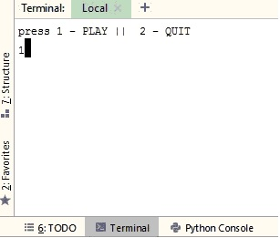

# 2048-game    
Ivlabs 2048 project    
The program works on both linux and windows os, on the linux os the progarm uses "readchar" library to take moves as input without pressing enter, and on windows program it uses "msvcrt" library for the same.    
The game is played using (keys):
W -> UP
A -> LEFT
S -> DOWN
d -> RIGHT

