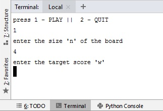
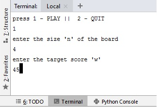
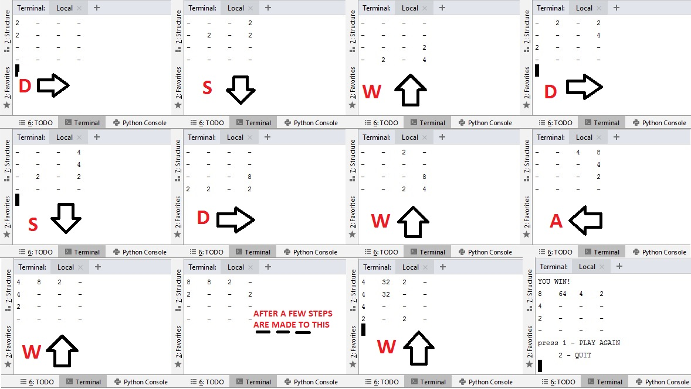
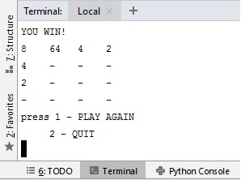
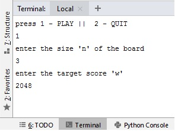
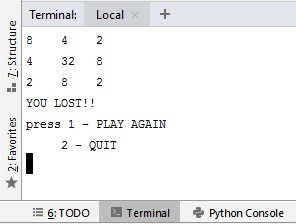

# 2048-game    
Ivlabs 2048 project    
Both linux and windows program work in exactly same manner, however, the linux progarm uses readchar library to take moves as input without pressing enter, on the other hand windows program uses msvcrt library for the same.    
In the first step user is asked to choose an option from PLAY and QUIT.    

option "1" starts whereas "2" quits the game, any other input is considered as invalid.    
In the second step user is asked to eneter SIZE OF BOARD"n". Pressing ENTER without giving any value will create board of default size"5".    

Similarly, input is taken in third step which desides target score"w". Default score here is 2048 if user does not pass any input and presses enter.    

After the value of "w" is passed the game commenses, thereafter, all the MOVES are taken WITHOUT the need of pressing ENTER.    

Every next step commenses only when the user enter "W" "A" "S" OR "D", where w = up;a = left; s = down; d = right.Other inputs are considered invalid.    

When the player reaches or crosses the target score he/she wins.    
The process then starts once again.    
    
It asks for the same inputs again.    
    

If player fails to reach the target score, he/she looses
